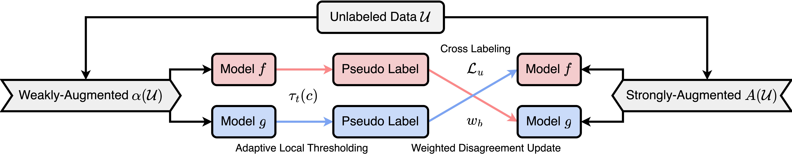

# JointMatch: Một phương pháp hợp nhất cho Pseudo-Labeling đa dạng và cộng tác trong phân loại văn bản bán giám sát



Repository này chứa mã nguồn của paper:
> **JointMatch: A Unified Approach for Diverse and Collaborative Pseudo-Labeling to Semi-Supervised Text Classification**  
> [[Paper]](https://aclanthology.org/2023.emnlp-main.451.pdf) [[ACL Anthology]](https://aclanthology.org/2023.emnlp-main.451/) [[OpenReview]](https://openreview.net/forum?id=ZAHyZ3CBds) [[arXiv]](https://arxiv.org/abs/2310.14583)  
> EMNLP 2023  
> Henry Peng Zou, Cornelia Caragea

---

## Cập nhật

- Đã bổ sung hướng dẫn sử dụng bộ dữ liệu tiếng Việt uit-vsfc.

---

## Cài đặt

### 1. Tạo môi trường và cài đặt phụ thuộc

```bash
conda create -n jointmatch python=3.8 -y
conda activate jointmatch

# Cài đặt pytorch
conda install pytorch==1.12.1 torchvision==0.13.1 torchaudio==0.12.1 -c pytorch

# Cài đặt các thư viện phụ thuộc khác
pip install -r requirements.txt
```

---

### 2. Chuẩn bị dữ liệu

**Cấu trúc thư mục:**
```
code/
  |-- criterions
  |-- models
  |-- utils
  |-- main.py
  |-- panel_main.py 
  ...
data/
  |-- uit-vsfc/
      |-- train.csv
      |-- dev.csv
      |-- test.csv
      |-- preprocess.ipynb
  |-- uit-vsfc-no-augmentation/
      |-- train.csv
      |-- dev.csv
      |-- test.csv
      |-- preprocess.ipynb
```

**Mô tả bộ dữ liệu:**
- Bộ dữ liệu [uit-vsfc](https://huggingface.co/datasets/uit-nlp/uit-vsfc) là bộ dữ liệu phân loại cảm xúc tiếng Việt, gồm các file `train.csv`, `dev.csv`, `test.csv`.
- Bạn có thể sử dụng thêm bộ `uit-vsfc-no-augmentation` nếu muốn thử nghiệm không dùng tăng cường dữ liệu.

---


## Trích dẫn

Nếu bạn thấy repo hữu ích, hãy trích dẫn paper gốc:

```bibtex
@inproceedings{zou2023jointmatch,
    title={JointMatch: A Unified Approach for Diverse and Collaborative Pseudo-Labeling to Semi-Supervised Text Classification},
    author={Zou, Henry and Caragea, Cornelia},
    booktitle={Proceedings of the 2023 Conference on Empirical Methods in Natural Language Processing},
    pages={7290--7301},
    year={2023}
}
```

---

## Acknowledgement

Repo này tham khảo dữ liệu và mã nguồn từ [SAT](https://github.com/declare-lab/SAT) và [USB](https://github.com/microsoft/Semi-supervised-learning).

---
